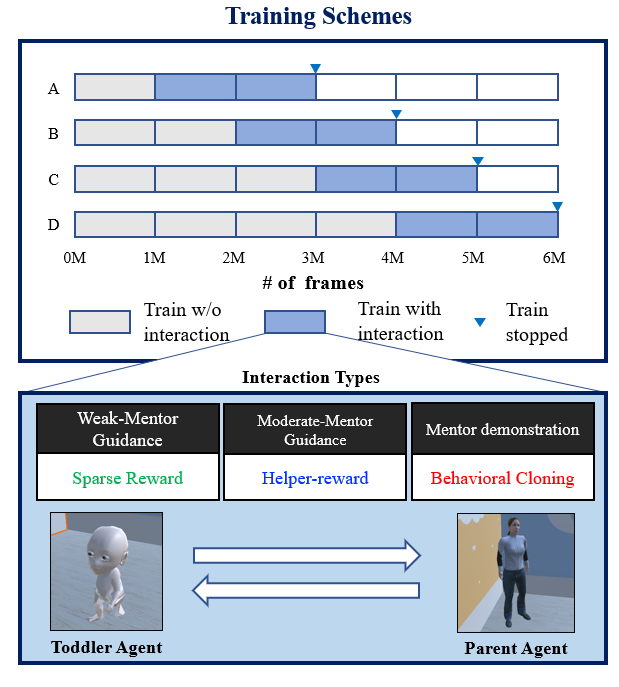
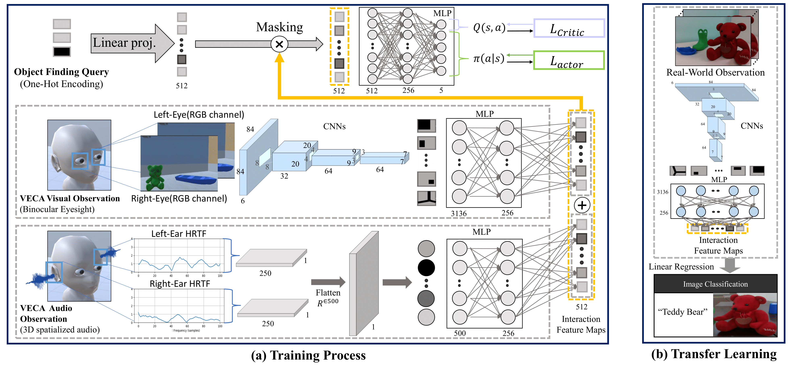

# Toddler-Guidance-Learning

## Abstract

Critical periods are phases during which a toddler’s brain devel-ops in spurts. To promote children’s cognitive development, properguidance is critical in this stage. However, it is not clear whethersuch a critical period also exists for the training of AI agents. Simi-lar to human toddlers, well-timed guidance and multimodal inter-actions might significantly enhance the training efficiency of AIagents as well. To validate this hypothesis, we adapt this notion ofcritical periods to learning in AI agents and investigate the criti-cal period in the virtual environment for AI agents. We formalizethe critical period and Toddler-guidance learning in the reinforce-ment learning (RL) framework. Then, we built up a toddler-likeenvironment with VECA toolkit to mimic human toddlers’ learn-ing characteristics. We study three discrete levels of mutual inter-action: weak-mentor guidance (sparse reward), moderate mentorguidance (helper-reward), and mentor demonstration (behavioralcloning). We also introduce the EAVE dataset consisting of 30,000real-world images to fully reflect the toddler’s viewpoint. We eval-uate the impact of critical periods on AI agents from two perspec-tives: how and when they are guided best in both uni- and multi-modal learning. Our experimental results show that both uni- andmultimodal agents with moderate mentor guidance and critical pe-riod on 1 million and 2 million training steps show a noticeableimprovement. We validate these results with transfer learning onthe EAVE dataset and find the performance advancement on thesame critical period and the guidance.
